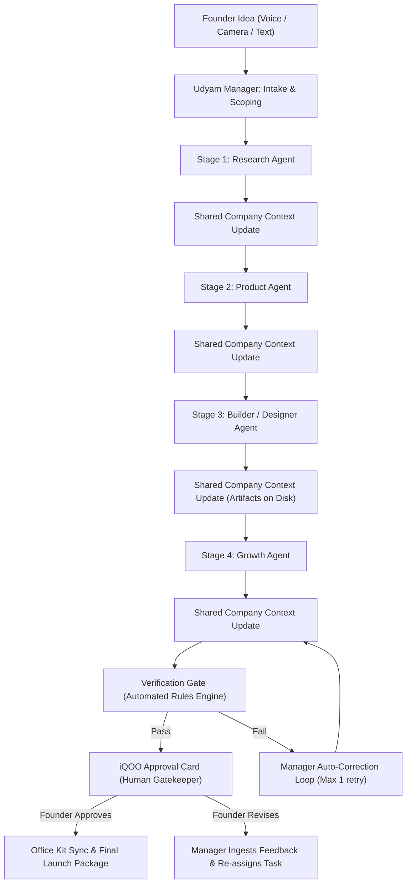

# Udyam OS — Prototype Scope & System Specification

**Project Name:** Udyam OS  
**Milestone:** Production-Ready Working Prototype  
**Target Device:** iQOO Smartphone (Primary Command Center) + Laptop (Office Kit Bridge)  
**Core Thesis:** `Founder → iQOO Phone → Udyam OS → AI Workforce → Real Business Outputs → Founder Approval → Launch Package`  
**Core Loop:** `IDEA → LAUNCH`  
**Document Version:** 1.0 (Phase 3 Specification)

---

## 1. Prototype Objective

The objective of this prototype is **NOT** to build a comprehensive multi-tenant SaaS or an autonomous conglomerate.

The sole, uncompromising objective is:
> **Build a rock-solid, demo-ready working prototype that proves a solo founder can take a raw business idea to an approved, verified launch package entirely driven from an iQOO smartphone via an autonomous 4-agent workforce.**

### Core Product Criteria:
1. **Phone-First Authenticity:** The iQOO phone is the active executive controller—capturing multimodal inputs (voice/camera), streaming live workforce operations, receiving push approval cards, and executing sign-off—not just an iframe or mobile web view.
2. **Real Artifact Generation:** The workforce produces tangible, inspectable files (`market_research.md`, `prd.md`, interactive `landing_page/index.html`, `launch_strategy.md`), not conversational chat bubbles.
3. **Deterministic Orchestration:** A single central engine (**Udyam Manager**) routes structured data across a shared company context without chaotic, token-wasting agent-to-agent loops.
4. **Human-in-the-Loop Governance:** The founder holds ultimate operational authority via a decisive on-device approval gate.

---

## 2. User Journey (Founder Experience)

```
[ Founder on the Move with iQOO Phone ]
                   │
                   ▼ (1) Idea Ingestion: Speaks idea / captures napkin sketch via iQOO camera
[ iQOO Phone App: Voice Transcription & Multimodal Ingestion ]
                   │
                   ▼ (2) Goal Dispatch: Pushes parsed founder intent to Udyam OS
[ Udyam Manager: Goal Decomposition & Context Initialization ]
                   │
                   ▼ (3) Real-Time Live Workforce Feed
[ 4 Specialized Agents Execute Sequentially against Shared Context ]
   ├── Research Agent ──► Discovers audience, competitors, problem-solution fit
   ├── Product Agent  ──► Formulates PRD, feature scope, and user flows
   ├── Builder Agent  ──► Generates deployable landing page (HTML/CSS) & UI assets
   └── Growth Agent   ──► Engineers launch positioning, channels, and outreach plan
                   │
                   ▼ (4) Automated Verification Engine
[ Quality & Consistency Audit: Validates cross-agent alignment and deliverables ]
                   │
                   ▼ (5) High-Priority Device Alert
[ iQOO Phone: Founder Approval Gate Screen ]
   - Interactive KPI preview
   - Live landing page inspection
   - One-tap "Approve & Launch" or "Request Refinement"
                   │
                   ▼ (6) Founder Tap: "APPROVED"
[ Office Kit Execution Bridge: Laptop syncs artifacts & packages launch bundle ]
                   │
                   ▼ (7) Launch Confirmation
[ Founder Receives Final Launch Manifest on iQOO Device ]
```

---

## 3. Core Workflow (`IDEA → LAUNCH`)

The workflow is a linear, state-enforced pipeline with shared state accumulation:



---

## 4. The 4 Specialized Workforce Agents

The prototype strictly features **four** focused agents. None are generic chatbots; each is a specialized worker with strict inputs, tools, and output contracts.

### 4.1 Research Agent
* **Role:** Market Intelligence & Problem-Solution Analyst.
* **Responsibilities:**
  - Identifies target customer profiles (ICP) and demographic/psychographic attributes.
  - Pinpoints the acute core problem and customer pain points.
  - Analyzes 3–5 real or benchmark competitors (strengths, weaknesses, market gaps).
  - Uncovers market opportunities, entry positioning, and underlying risks.
  - Formulates testable core business assumptions.
* **Input:** Raw `FounderIntent` from Udyam Manager.
* **Output:** Structured `ResearchReport` written to shared context and saved as `artifacts/research_brief.md`.

### 4.2 Product Agent
* **Role:** Chief Product Officer / Solutions Architect.
* **Responsibilities:**
  - Converts research insights into a crisp product definition and value proposition.
  - Defines the Minimum Viable Product (MVP) core feature set (Must-Have vs Nice-to-Have).
  - Outlines the primary user journey and core conversion funnel.
  - Specifies functional product requirements and data flow.
* **Input:** `FounderIntent` + `ResearchReport` from Shared Context.
* **Output:** Structured `ProductRequirementsDocument (PRD)` saved as `artifacts/product_requirements.md`.

### 4.3 Builder / Designer Agent
* **Role:** Lead Front-End Engineer & Visual Designer.
* **Responsibilities:**
  - Translates the PRD and target persona into a working, responsive web landing page.
  - Generates valid, semantic, modern `index.html` and `styles.css` (responsive, glassmorphism/modern dark aesthetics).
  - Produces UI concept specifications, copy wireframes, and hero asset placeholders.
* **Input:** `ProductRequirementsDocument` + Brand attributes from Shared Context.
* **Output:** Executable Web Artifacts in `artifacts/landing_page/index.html` and `artifacts/landing_page/styles.css`.

### 4.4 Growth Agent
* **Role:** Head of Growth & Go-to-Market Strategist.
* **Responsibilities:**
  - Develops strategic positioning statement and launch narrative.
  - Identifies primary zero-cost and paid customer acquisition channels.
  - Drafts launch day tactical playbook (Product Hunt teaser, founder Twitter/LinkedIn launch thread, cold outreach templates).
  - Sets measurable Day 1 to Day 30 launch milestones.
* **Input:** `ResearchReport` + `ProductRequirementsDocument` + `LandingPageURL` from Shared Context.
* **Output:** Structured `GoToMarketPlan` saved as `artifacts/launch_strategy.md`.

---

## 5. Udyam Manager Responsibilities

The **Udyam Manager** is the central brain and kernel orchestrator of Udyam OS.

1. **Goal Parsing & Decomposition:** Translates raw voice transcripts, camera OCR/descriptions, or mobile inputs into a structured `ProjectGoal`.
2. **Context Ownership:** Initializes and maintains the `SharedCompanyContext`, ensuring no agent operates in isolation.
3. **Sequential Pipeline Execution:** Dispatches tasks to the 4 agents in strict sequence, guaranteeing dependencies are resolved before subsequent stages begin.
4. **Telemetry & Event Broadcasting:** Emits real-time progress events (`agent_started`, `agent_thought`, `tool_executed`, `artifact_written`) over WebSockets to the iQOO phone.
5. **Quality Verification Trigger:** Executes the automated consistency check once all 4 agents complete their runs.
6. **Approval Dispatcher:** Formats the final executive summary and pushes the interactive `ApprovalRequest` to the iQOO phone.
7. **Feedback Routing:** If the founder requests revisions on the phone, the Manager parses the feedback, updates the shared context, and re-triggers the specific agent responsible.

---

## 6. Shared Company Context

The Shared Company Context is an in-memory and file-backed structured state repository. It eliminates repetitive prompts, avoids hallucinations, and enforces company-wide coherence.

```json
{
  "project_id": "udyam_demo_001",
  "project_name": "AgroPulse",
  "tagline": "AI Crop Diagnosis & Instant Marketplace for Indian Farmers",
  "timestamp": 1727615000,
  "founder_intent": {
    "raw_input": "An AI app for small farmers to detect crop disease from photos and connect to local suppliers",
    "modality": "voice_and_camera",
    "language": "en-IN"
  },
  "market_context": {
    "target_icp": "Marginal farmers (1-5 acres) in Tier 2/3 rural belts",
    "core_pain": "40% crop loss due to delayed disease identification",
    "competitors": ["Plantix", "KisanSuvidha", "AgroStar"],
    "market_gap": "Hyper-local vernacular audio guidance + direct input supply linking"
  },
  "product_context": {
    "mvp_scope": ["Photo diagnosis", "Audio remedy advisory", "1-click local supplier call"],
    "user_flow": ["Snap Leaf Photo", "Get Diagnosis in 3s", "Order Remedy or Call Dealer"],
    "tech_stack": "Mobile Web / PWA"
  },
  "brand_context": {
    "primary_color": "#10B981",
    "accent_color": "#F59E0B",
    "tone": "Trustworthy, empowering, urgent"
  },
  "growth_context": {
    "launch_channels": ["WhatsApp farmer groups", "Krishi Vigyan Kendra demo", "Kisan WhatsApp bot"],
    "hero_hook": "Save your crop before sunset with a single photo."
  },
  "artifacts": {
    "research_brief": "artifacts/research_brief.md",
    "prd": "artifacts/product_requirements.md",
    "landing_page_html": "artifacts/landing_page/index.html",
    "landing_page_css": "artifacts/landing_page/styles.css",
    "launch_strategy": "artifacts/launch_strategy.md"
  },
  "status": "AWAITING_FOUNDER_APPROVAL"
}
```

---

## 7. Artifact Outputs

The prototype produces real, persisted business deliverables in the `artifacts/` folder:

| Artifact Name | Generating Agent | File Path | Format | Verification Criteria |
| :--- | :--- | :--- | :--- | :--- |
| **Market Research Brief** | Research Agent | `artifacts/research_brief.md` | Markdown | ICP, Problem, 3 Competitors, GTM Wedge |
| **Product Requirements (PRD)** | Product Agent | `artifacts/product_requirements.md` | Markdown | Problem, MVP Scope, User Stories, Tech Specs |
| **Live Landing Page** | Builder Agent | `artifacts/landing_page/index.html`<br>`artifacts/landing_page/styles.css` | HTML5 / CSS3 | Valid HTML, Responsive, Working CTA, Persona-tailored |
| **Launch & GTM Strategy** | Growth Agent | `artifacts/launch_strategy.md` | Markdown | Channels, Launch Thread, Value Prop, Timeline |
| **Consolidated Launch Package** | Udyam Manager | `artifacts/launch_package.json` | JSON | Complete metadata, artifact links, approval signature |

---

## 8. Verification Engine

Before bothering the founder with an approval notification, Udyam Manager executes an **Automated Verification Check**:

1. **Artifact Integrity:** Verifies that all expected files exist on disk, are non-empty, and exceed minimum length thresholds.
2. **HTML Validity Check:** Ensures `index.html` has valid structure (`<!DOCTYPE html>`, `<html>`, `<head>`, `<body>`), contains no unrendered template tags (e.g. `{{title}}`), and links to `styles.css`.
3. **Cross-Agent Consistency Audit:**
   - Does the Landing Page hero copy align with the value proposition in the PRD?
   - Does the Growth launch copy target the ICP defined in the Research Brief?
4. **Verification Output:** If checks pass, state transitions to `AWAITING_APPROVAL`. If a fatal flaw is found, Udyam Manager triggers a single bounded auto-correction step before escalating.

---

## 9. Founder Approval (The iQOO Moment)

The **Founder Approval Gate** is the core climax of the prototype demonstration.

* **Trigger:** Udyam Manager issues a high-priority approval event over WebSocket to the iQOO phone.
* **Phone Interface Display:**
  - Audio/Haptic notification alert on the iQOO device.
  - **Approval Card UI:**
    - Executive Summary: Problem, Solution, Target Audience.
    - Mini KPI metrics (estimated time to launch, core deliverables count).
    - **Interactive Preview Button:** Directly views the generated landing page inside the mobile screen.
  - **Action Controls:**
    - 🟢 **Approve & Launch:** Locks context, signs off package, initiates Office Kit sync.
    - 🟡 **Request Refinement:** Allows founder to speak or type a critique (e.g., *"Make the pricing free tier more prominent"*). Udyam Manager re-engages the Builder Agent and refreshes the artifact.

---

## 10. Phone-First Capabilities on iQOO

The iQOO phone is not a spectator; it exercises genuine smartphone capabilities tied to business functions:

| Phone Capability | Concrete Business Purpose | Implementation Mechanism in Prototype |
| :--- | :--- | :--- |
| **Voice Input** | Hands-free Founder Idea Ingestion on the move | Web Speech API / Audio Recording endpoint with transcription |
| **Camera Input** | Ingesting whiteboard sketches, competitor flyers, or product notes | Native camera file picker / camera stream upload parsed into intent |
| **Real-Time Event Feed** | Live transparency into autonomous workforce activities | Dedicated WebSocket connection streaming JSON event logs with tactile status cards |
| **Mobile Artifact Preview** | Instant visual inspection of generated landing page | Sandboxed iframe rendering `artifacts/landing_page/index.html` sized for mobile viewport |
| **Haptic / Push Alert** | Urgent call-to-action when executive sign-off is needed | Web Notification API / Haptic Vibration API trigger on approval dispatch |
| **One-Tap Approval** | Rapid executive decision-making | High-contrast touch buttons triggering signed approval mutation to backend |

---

## 11. Office Kit Role

**Office Kit** serves as the collaborative bridge between the mobile command center and desktop/laptop execution environment:

```
[ iQOO Phone ]  ──(1. Push Idea / Directive)──►  [ Udyam OS Backend ]
                                                           │
                                                  (2. Autonomous Work)
                                                           │
[ iQOO Phone ]  ◄──(3. Approval Request)─────────          ▼
      │                                            [ Laptop Workspace ]
  (4. Approved)                                    - Full code inspection
      │                                            - Local web server preview
      └─────────►(5. Office Kit Sync Trigger)───►  - Terminal build / deploy ready
```

### The Prototype Office Kit Workflow (Strictly One Meaningful Flow):
* **"Approve & Desk-Sync":**
  1. The founder reviews and approves the launch package on their iQOO phone.
  2. Udyam OS triggers an Office Kit event.
  3. The connected laptop desktop screen immediately updates:
     - Automatically opens the generated `landing_page/index.html` in the desktop browser.
     - Spawns the ready-to-deploy launch bundle in the local filesystem.
     - Displays a desktop notification: *"Founder approved AgroPulse via iQOO Phone. Launch assets primed."*

---

## 12. Real vs Simulated Features Matrix

To maintain rigorous engineering honesty, every feature is explicitly classified:

| Feature / Subsystem | Classification | Implementation Detail |
| :--- | :--- | :--- |
| **Udyam Manager Orchestrator** | **REAL** | Python async state machine managing pipeline execution, events, and context. |
| **Shared Company Context** | **REAL** | Real in-memory state model serialized to `artifacts/company_context.json`. |
| **4 Agent Execution & Prompts** | **REAL** | Structured LLM prompt chains (or deterministic fallback mode for demo guarantee) writing to context. |
| **Artifact Generation** | **REAL** | Real files (`research_brief.md`, `prd.md`, `index.html`, `styles.css`) physically generated on disk. |
| **Verification Checks** | **REAL** | Automated Python validation functions verifying file existence, non-empty content, and HTML structure. |
| **Founder Mobile Approval Gate** | **REAL** | Real interactive mobile card triggering backend approval state transition. |
| **WebSocket Event Streaming** | **REAL** | Real WebSocket connection broadcasting live lifecycle events from backend to phone. |
| **Phone Voice Transcription** | **PARTIALLY REAL** | Web Speech API in browser or audio file upload to transcription endpoint; pre-recorded fallback audio available. |
| **Phone Camera Input** | **PARTIALLY REAL** | Real image upload from mobile camera; mock vision prompt extraction to guarantee demo speed. |
| **Office Kit Desk Sync** | **PARTIALLY REAL** | Real local WebSocket ping from backend to desktop client opening local browser and displaying files. |
| **On-Device NPU / Local LLM** | **SIMULATED / FALLBACK** | Reasoned remotely in cloud/local server. Architecture isolates model client so on-device engine (e.g. llama.cpp / MLC) can be swapped in Phase 5 without touching business logic. |
| **Live Domain Deployment** | **SIMULATED / DEMO FALLBACK**| Served via local web server preview instead of provisioning live DNS/Vercel during the pitch. |

---

## 13. Explicitly Excluded Features (Out of Scope)

The following items are **strictly prohibited** from the prototype scope to prevent bloat, instability, and missed deadlines:

* ❌ **No CRM or ERP Systems:** No lead management tables, customer databases, or inventory trackers.
* ❌ **No Payment Gateways & Invoicing:** No Stripe, Razorpay, or billing integration.
* ❌ **No 10+ Multi-Agent Swarms:** Exactly 4 specialized agents + 1 manager. No autonomous sub-delegation rabbit holes.
* ❌ **No Unbounded Agent Chat:** Agents do not chat with each other; they communicate strictly through the shared company context and manager.
* ❌ **No Multi-Tenant SaaS or Complex Auth:** Single-user founder demo mode. No OAuth, JWT clusters, or permission roles.
* ❌ **No Heavy Container Sandboxing (Docker):** Runs in a clean local workspace directory, avoiding Docker daemon dependencies.
* ❌ **No Full Social Media Automation:** No direct Twitter/LinkedIn API posting; produces copy artifacts ready for manual review.
* ❌ **No WhatsApp / Telegram Bots:** All mobile interaction occurs via the dedicated iQOO web/PWA mobile interface.
* ❌ **No Enterprise Cloud Infra (Kubernetes, Terraform, AWS clusters):** Pure standalone FastAPI + Vite/vanilla client.

---

## 14. Definition of Done (DoD)

The prototype will be considered **Complete and Demo-Ready** when all of the following conditions are met:

1. **End-to-End Pipeline Execution:** A user can input an idea via voice or text, and the system executes `Manager → Research → Product → Builder → Growth → Verify → Approval` in under 90 seconds.
2. **Four Distinct Artifacts on Disk:** Real files exist under `artifacts/` with valid markdown and renderable HTML/CSS.
3. **Mobile Phone Responsiveness:** The mobile UI on the iQOO device smoothly streams live agent cards, renders the artifact preview, and presents the approval dialog without layout glitches.
4. **Approval Gate Enforcement:** The pipeline strictly halts at the verification stage and does NOT produce the final launch package until the founder physically clicks **Approve** on the iQOO phone.
5. **Office Kit Trigger:** Approving on the phone immediately causes the desktop/laptop environment to display the completed artifacts.
6. **Graceful Error Handling & Fallback:** If an LLM API call experiences rate limiting or network latency, the system seamlessly uses curated fallback demo data to guarantee zero failure during live walkthroughs.

---

## 15. Founder Walkthrough Scenario (3-Minute Live Demonstration)

* **Time: 0:00 - 0:30 (The Hook & Input on iQOO)**
  - Presenter holds up the iQOO smartphone.
  - Presses the mic button: *"Build AgroPulse — an on-demand AI crop health diagnosis service with instant local fertilizer store ordering for smallholder farmers in Maharashtra."*
  - Snaps a photo of a rough leaf sketch or problem diagram.
  - Presses **"Launch Udyam OS"**.

* **Time: 0:30 - 1:30 (The AI Workforce in Action)**
  - Phone screen dynamically pulses with live agent status events:
    - *Research Agent:* "Identified 3 regional competitors. Wedge: zero-typing vernacular voice guidance."
    - *Product Agent:* "Drafted 3-screen MVP flow. Focus on 1-click merchant connect."
    - *Builder Agent:* "Generating mobile-responsive landing page with interactive diagnosis simulator."
    - *Growth Agent:* "Crafted WhatsApp viral loop and Krishi Kendra outreach plan."

* **Time: 1:30 - 2:15 (The iQOO Moment — Founder Approval)**
  - Haptic buzz on the iQOO phone.
  - Approval card pops up: *"Launch Package Ready for Review."*
  - Presenter taps "Preview Landing Page" directly on the iQOO screen, scrolling through the rendered HTML/CSS.
  - Presenter taps **"Approve & Deploy"**.

* **Time: 2:15 - 3:00 (The Office Kit Payoff & Conclusion)**
  - The laptop on stage springs to life: opens the verified landing page and launch manifest.
  - Presenter concludes: *"From a 10-second voice thought on an iQOO phone to a verified, complete business launch package with a 4-agent workforce — in under 2 minutes. This is Udyam OS."*
